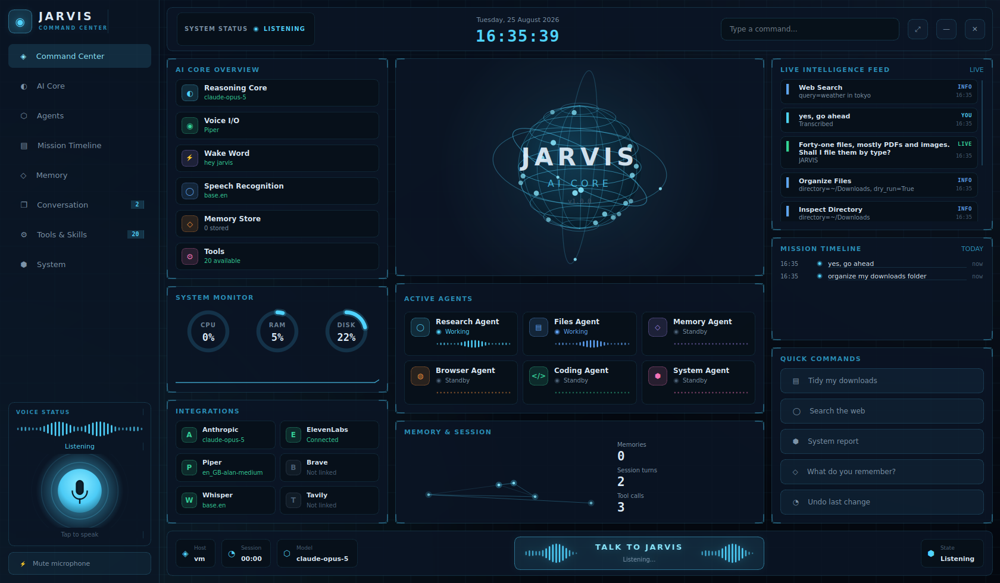

# J.A.R.V.I.S.

A voice-driven desktop assistant in the Iron Man mould. Leave it running in the
corner of your screen. Say **"hey JARVIS"**, ask for something, and it does it —
organizes your files, searches the web, opens apps, answers questions — then
tells you what it did, out loud, in a British accent.



*Everything on that screen is live — see [Two window modes](#two-window-modes).
Regenerate the shot with `python tools/screenshot.py`.*


---

## Quick start

### Windows — installer (easiest)

1. Download **[JARVIS-Setup-1.0.0.exe](https://github.com/tcmg5/SUNDAY/releases/download/v1.0.0/JARVIS-Setup-1.0.0.exe)** (178 MB).
   There is also a [portable zip](https://github.com/tcmg5/SUNDAY/releases/download/v1.0.0/JARVIS-portable-1.0.0.zip)
   (245 MB) that needs no installation - unzip it and run `JARVIS.exe`.
   Older and newer builds are on the [Releases page](https://github.com/tcmg5/SUNDAY/releases).
2. Run it. No administrator rights needed — it installs into your user profile.
   - Windows SmartScreen will say the publisher is unknown, because the build
     isn't code-signed. Click **More info** → **Run anyway**. Signing needs a
     certificate that costs a few hundred a year; see
     [Code signing](#code-signing).
3. Launch **JARVIS** from the Start menu or desktop.
4. On first run it asks for your Anthropic API key
   ([get one here](https://console.anthropic.com/settings/keys)), lets you pick
   a voice, and downloads about 200 MB of speech models. Once.
5. **Allow the microphone** when Windows asks. If it never asks, go to
   `Settings → Privacy & security → Microphone` and turn on
   **"Let desktop apps access your microphone"**.

Then say **"hey JARVIS"**.

Your settings, API key and downloaded models live in
`%APPDATA%\JARVIS`. Uninstalling asks before removing them.

**If it doesn't start:** Start menu → **JARVIS diagnostics**. That's the same
app built with a console attached, running `doctor`, so you can actually read
the error.

### Windows — from source

For development, or if you'd rather not run an unsigned binary:

1. Install Python from [python.org/downloads](https://www.python.org/downloads/),
   ticking **"Add python.exe to PATH"** on the first installer screen.
2. Download the code (green `Code` button → `Download ZIP` → extract).
3. Right-click `setup.ps1` → **Run with PowerShell**.
   - If Windows says *"running scripts is disabled on this system"*, open
     PowerShell in the folder and run these two lines. The first relaxes the
     policy **for that window only**:
     ```powershell
     Set-ExecutionPolicy -Scope Process -Bypass -Force
     .\setup.ps1
     ```
4. Put your API key in `.env`, then double-click `JARVIS.bat`.
   Use `JARVIS (show errors).bat` if nothing appears to happen.

### macOS / Linux

```bash
git clone <this repo> && cd SUNDAY
./setup.sh
echo "ANTHROPIC_API_KEY=sk-ant-..." > .env
python -m jarvis
```

### Verify before you start

```bash
python -m jarvis doctor         # checks every dependency and key separately
```

`doctor` is the one to reach for when something's wrong - it checks each
subsystem independently and tells you exactly what's missing and how to fix it,
rather than dying with a stack trace on launch.

### Requirements

- Python 3.9+
- An Anthropic API key ([console.anthropic.com](https://console.anthropic.com))
- A microphone
- ~2 GB disk for the local speech models (downloaded once, on first run)

Everything except the reasoning runs **locally and offline**: the wake word,
speech recognition, and the voice. Only the thinking goes to the API.

---

## The Voice

You asked me to find the right voice. Here's what's actually available, best
first.

### 1. ElevenLabs — closest to the films, paid

Nothing free comes near it. ElevenLabs' voice designer produces a genuinely
convincing JARVIS, and the community has published several presets. Free tier
covers roughly 10 minutes of speech a month; the cheapest paid tier is about
$5/month, which is a lot of assistant replies.

```yaml
# config.yaml
tts:
  engine: elevenlabs
  elevenlabs_voice_id: "<paste the voice ID here>"
```
```bash
echo "ELEVENLABS_API_KEY=..." >> .env
```

Browse or design one at [elevenlabs.io](https://elevenlabs.io/voice-library) —
search "JARVIS" or "British butler AI". [Fish Audio](https://fish.audio) also
hosts a free ready-made Jarvis/Iron Man voice if you'd rather not design one.

### 2. Piper `en_GB-alan-medium` — free, offline, the default

This is what ships enabled. Piper is a fast local neural TTS; `alan` is a
British male read that is calm and slightly clipped — the right register.
It isn't Paul Bettany, but it's unmistakably the same character, it costs
nothing, it works with no internet, and latency is about 50 ms.

```bash
python -m jarvis voices              # see all the candidates
python -m jarvis say "Good evening. All systems are nominal."
```

| Voice | Character |
|---|---|
| `en_GB-alan-medium` ★ | Calm, measured British male. The default. |
| `en_GB-northern_english_male-medium` | Warmer, more casual |
| `en_GB-semaine-medium` | Clipped and formal — more android than butler |
| `en_US-ryan-high` | Very clean American, if you don't want the accent |

### 3. The filter — where most of the character actually comes from

Raw TTS sounds like an audiobook. JARVIS sounds like a voice *in a room*. That
difference is signal processing, not the voice model, and it's applied on top of
whichever engine you choose ([`jarvis/audio/tts.py`](jarvis/audio/tts.py)):

- **120 Hz high-pass** — strips the chesty low end that marks a recording as
  close-mic'd
- **Presence tilt** — a gentle high shelf so it carries across a room
- **Short multi-tap reverb** — five non-harmonically spaced reflections, giving
  a tail that reads as "large, quiet space" without sounding like a cathedral

Hear it for yourself:

```bash
python -m jarvis say "Good evening, sir."                    # filtered
JARVIS_TTS_JARVIS_FILTER=false python -m jarvis say "Good evening, sir."
```

Tune `filter_reverb` in `config.yaml` — `0.0` is dry, `0.18` is the default,
`0.35` is a hangar.

### The wake word

"Hey JARVIS" isn't an arbitrary choice: [openWakeWord](https://github.com/dscripka/openWakeWord)
ships a pretrained `hey_jarvis` model, trained on ~200,000 synthetic utterances
of that exact phrase, scoring 0.98+ on clear speech. It runs offline on CPU with
no account or key. The wake phrase you wanted is, conveniently, the one with the
best free model already trained for it.

If it triggers too often, raise `wake.threshold` toward 0.65. If it misses you,
lower it toward 0.35.

---

## Things to say

**Files**
> "Hey JARVIS — organize my downloads."
> "Clean up my desktop by date."
> "Find every PDF I saved this week."
> "Which files are eating the most space in Documents?"
> "Undo that."

**Web**
> "What's the weather in Tokyo?"
> "Search for the best mechanical keyboards and tell me the top three."
> "Pull up the React docs."       ← opens the browser
> "Who won the game last night?"  ← reads you the answer

**Desktop**
> "Open Spotify."
> "Take a screenshot."
> "Set the volume to thirty."
> "What's on my clipboard?"
> "System status."

**Memory**
> "Remember that my project folder is Documents slash Atlas."
> "Where's my project folder?"

After it answers, it keeps listening for about 8 seconds — so you can just say
"and also open Slack" without the wake word again. Say "never mind" to cancel,
or "stand down" to end the exchange.

Can't talk? Type in the HUD's input box, or run `python -m jarvis --text`.

---

## What it will and won't do to your files

This is the part worth reading carefully, since it has write access to your
disk.

**Sandboxed.** JARVIS may only touch paths under `files.safe_roots` — by default
Desktop, Downloads, Documents and Pictures. Everything else is refused. Paths
are fully resolved before the check, so `~/Downloads/../../.ssh/id_rsa` fails
rather than sneaking past a string comparison. Names like `.ssh`, `.aws`,
`.git` and `AppData` are blocked even inside a permitted root.

**Plan first, then apply.** `organize_files` runs as a dry run by default and
returns a plan. JARVIS is instructed to read that plan back to you and wait for
a yes before applying it. Batches over 25 files need explicit confirmation
regardless.

**Reversible.** Every applied move is journaled to `data/file_journal.jsonl`.
"Undo that" puts everything back, including removing folders it created.

**Never a hard delete.** There is no permanent-delete tool. Deletions go to the
system trash, and nowhere else.

**Shell is off.** Set `shell.enabled: true` if you want it, and even then
anything outside the allowlist requires spoken confirmation, with a hard-coded
refusal list on top.

Widening `safe_roots` to `~` is possible. It is also a bad idea.

---

## Configuration

`config.yaml` (copy from `config.example.yaml`); keys go in `.env`. Every
setting is documented inline. The ones you'll actually touch:

| Setting | Why you'd change it |
|---|---|
| `assistant.address_user_as` | It calls you "sir" by default. Your name works. |
| `wake.threshold` | Too many false triggers, or it can't hear you |
| `audio.silence_timeout_sec` | Raise it if it cuts you off mid-sentence |
| `audio.input_device` | Pick a specific mic (`python -m jarvis devices`) |
| `stt.model` | `small.en` is more accurate, `tiny.en` is faster |
| `tts.piper_voice` | A different voice |
| `files.safe_roots` | Which directories it may touch |
| `ui.mode` | `command_center`, `hud`, or `console` |
| `ui.position` | Which corner the compact HUD sits in |

Any setting can be overridden by environment variable:
`JARVIS_WAKE_THRESHOLD=0.7 python -m jarvis`

---

## Leaving it running

**macOS** - `Settings → General → Login Items → +` and add a small launcher:
```bash
#!/bin/bash
cd /path/to/SUNDAY && ./.venv/bin/python -m jarvis
```
Grant Microphone and Accessibility permission the first time it asks.

**Windows** - press Win+R, type `shell:startup`, and drop a copy of the
desktop shortcut into that folder.

**Linux** - a `.desktop` file in `~/.config/autostart/` with
`Exec=/path/to/SUNDAY/.venv/bin/python -m jarvis`.

### Two window modes

**Command center** (default) - the full dashboard above, meant for a second
monitor or a spare corner of a big one. Frameless: drag the header to move,
double-click it to maximize, Esc to quit. Space triggers listening without the
wake word. Every panel is live:

| Panel | Fed by |
|---|---|
| AI Core Overview | which subsystems actually loaded, and their models |
| Holo core | assistant state - colour and spin rate follow it |
| Live Intelligence Feed | real transcripts, replies, tool calls and errors |
| Active Agents | lights the tile whose tool group just ran |
| Mission Timeline | your actual requests this session, newest first |
| System Monitor | psutil CPU / RAM / disk |
| Memory & Session | entries in the memory store, turns, tool calls |
| Integrations | which API keys and engines are genuinely configured |

An "agent" here is a named group of tools, not a separate process - the
Research tile lights when `web_search` runs, Files when `organize_files` does.
The tiles report real work; they aren't decoration.

**Compact HUD** - `python -m jarvis --ui hud`, or set `ui.mode: hud`. A small
always-on-top panel with the arc reactor and a transcript feed, for when you
want it present but not occupying a screen.

### Fonts

The UI asks for `Orbitron` and `Rajdhani` first and falls back to whatever your
system has. Installing those two (both free on Google Fonts) is the single
biggest visual upgrade - the layout is designed around them.

---

## How it works

```
  mic ─► wake word ─► endpointer ─► whisper ─► Claude ─► tools
        (openWakeWord)  (webrtcvad)  (local)      │         │
                                                  ▼         ▼
                                       piper/ElevenLabs   files, web,
                                            + filter      desktop
                                                  │
                                                  ▼
                                              speakers
```

One microphone stream feeds everything, with a 1.5 s pre-roll buffer so speech
that overlaps the wake word isn't lost. The assistant loop runs on its own
thread and publishes state to an event bus; the Qt HUD subscribes and draws.

```
jarvis/
├── audio/     mic, wake word, endpointing, speech-to-text, voice
├── brain/     Claude tool-use loop, persona prompt, the tools themselves
│   └── tools/ files · web · system · shell
├── core/      state machine, event bus, path safety
└── ui/        command center dashboard, compact HUD, console fallback
    ├── theme.py    colour tokens, type scale, Qt stylesheet
    ├── widgets.py  painted instruments: globe, gauges, waveforms
    └── panels.py   composite rows: agent cards, feed items, providers
```

Adding a tool is one function plus one `_reg(...)` call in
[`jarvis/brain/tools/__init__.py`](jarvis/brain/tools/__init__.py).

---

## Troubleshooting

Run `python -m jarvis doctor` first. Then:

**It never wakes up.** Check the mic with `python -m jarvis devices` and set
`audio.input_device`. Lower `wake.threshold` to 0.35. Say "hey JARVIS" as one
phrase, not two words with a gap.

**It wakes up at random.** Raise `wake.threshold` to 0.65.

**It cuts me off mid-sentence.** Raise `audio.silence_timeout_sec` to 1.5.

**It mishears me in a noisy room.** JARVIS ships its own voice detector, which
needs no dependencies and works everywhere. In a genuinely noisy room, Google's
webrtcvad does better — install it with `pip install webrtcvad` (macOS/Linux)
and JARVIS picks it up automatically. It isn't bundled because upstream
publishes no Windows wheels and the prebuilt fork breaks the packaged build.

**It hears itself and replies to its own voice.** Headphones fix it outright.
The mic buffer is already flushed after each reply, but a loud speaker close to
a sensitive mic can still get through.

**`OSError: PortAudio library not found`.** `brew install portaudio` on macOS,
`sudo apt install portaudio19-dev` on Debian/Ubuntu. Windows needs nothing -
PortAudio ships inside the `sounddevice` wheel.

**Windows: `'python' is not recognized`.** Python isn't on your PATH. Reinstall
from python.org and tick **"Add python.exe to PATH"**, or use `py` in place of
`python`.

**Windows: `error: Microsoft Visual C++ 14.0 or greater is required`.** A
package tried to compile from source. `requirements.txt` already routes around
the usual culprit (`webrtcvad` → `webrtcvad-wheels`, which ships prebuilt
binaries), so if you still hit this, the error names the package - paste it into
an issue rather than installing 6 GB of Build Tools.

**Windows: the shortcut does nothing.** Run `JARVIS (show errors).bat` to see
the real message. Usually a missing API key in `.env`.

**Qt won't start on Linux.** `sudo apt install libxcb-cursor0 libegl1`. Or run
with `--ui console`.

**The dashboard is too big for my screen.** Use `--ui hud` for the compact
overlay, or set `ui.start_maximized: false`. Minimum usable size is 1180x760.

**Whisper is slow.** Use `stt.model: tiny.en`, or set `stt.device: cuda` if you
have an NVIDIA GPU.

Full logs are in `logs/jarvis.log`.

---

## Building the Windows app

PyInstaller can't cross-compile, so the executable is built on a Windows runner
by [`.github/workflows/build-windows.yml`](.github/workflows/build-windows.yml).
It runs on every push to a `claude/**` branch and on demand, and produces two
artifacts: the installer, and a portable zip for anyone who'd rather not
install anything.

Tagging publishes a GitHub Release:

```bash
git tag v1.0.0 && git push origin v1.0.0
```

The build does three things worth knowing about:

- **Two executables.** `JARVIS.exe` is windowed, so no console flashes up behind
  the dashboard. `JARVIS-console.exe` is the same application with a console
  attached — the only way to read a crash message from a windowed build.
- **A smoke test.** CI runs `JARVIS-console.exe doctor` against the packaged
  binary and fails the build if any subsystem is missing. PyInstaller failures
  are almost always missing dynamic imports, which never show up at build time
  and always show up on a user's machine.
- **`--onedir`, not `--onefile`.** A single-file build unpacks ~400 MB to a temp
  directory on every launch, which adds seconds to startup and trips antivirus.

To build locally on a Windows machine:

```powershell
pip install -r requirements.txt pyinstaller pillow
python tools/make_icon.py
pyinstaller jarvis.spec --noconfirm --clean
.\dist\JARVIS\JARVIS.exe
```

### Code signing

The build isn't signed, so SmartScreen warns on first run. To sign it, add an
Authenticode certificate as the `WINDOWS_CERT` / `WINDOWS_CERT_PASSWORD`
repository secrets and a `signtool` step after the PyInstaller step. An OV
certificate runs roughly $200–400/year; an EV one clears SmartScreen
immediately but costs more.

## Tests

```bash
python -m pytest tests/ -q      # 95 tests, no hardware or network needed
```

The suite concentrates on the parts where a bug is expensive: the path sandbox,
the organize/undo round trip, the tool-use loop (against a stubbed client), the
endpointing that decides when you've stopped talking, and the tool-to-agent-tile
mapping that goes stale the moment someone adds a tool and forgets the UI.

UI tests run headless via Qt's offscreen platform, and skip entirely if PySide6
isn't installed.
